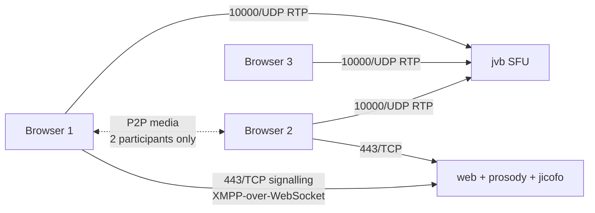

# Repository Guidelines

## Project Overview

Self-hosted [Jitsi Meet](https://jitsi.org) for a 3-person team ("Konvoy Team Video"). Local Ubuntu/Debian server first — Docker Compose, behind NAT, static public IP, Let's Encrypt — with AWS migration deferred until real bandwidth is measured (`README.md:3`, `jitsi-v1-setup-guide.md:3`).

**This repo contains no application source code.** It is a configuration + runbook repo: three artifacts that are copied *into* an unpacked upstream [`jitsi/docker-jitsi-meet`](https://github.com/jitsi/docker-jitsi-meet) release living outside this tree. There is no `package.json`, `Makefile`, or `Dockerfile` here, and no `docker-compose.yml` — the compose files ship in the upstream release archive and are deliberately not vendored (`jitsi-v1-setup-guide.md:62`), so reach for env vars and `custom-config.js` before introducing local build machinery.

Source of truth: [Jitsi Handbook — Docker self-hosting](https://jitsi.github.io/handbook/docs/devops-guide/devops-guide-docker), checked 5 Sep 2026 (`jitsi-v1-setup-guide.md:4`).

## Architecture & Data Flow

Four upstream containers, all configured indirectly through env vars (`jitsi-v1-setup-guide.md:91`, `:154`):

| Service | Role | Configured by |
|---|---|---|
| `web` | nginx + Jitsi Meet JS frontend, ACME/cert renewal cron | `HTTP_PORT`, `HTTPS_PORT`, `PUBLIC_URL`, `LETSENCRYPT_*`, `ENABLE_*_PAGE` |
| `prosody` | XMPP signalling + internal user accounts | `AUTH_TYPE`, `ENABLE_AUTH`, `ENABLE_GUESTS`, `*_PASSWORD` |
| `jicofo` | conference focus / allocation | `JICOFO_AUTH_PASSWORD`, `JICOFO_AUTH_LIFETIME`, `JICOFO_MAX_MEMORY` |
| `jvb` | videobridge SFU (media) | `JVB_AUTH_PASSWORD`, `JVB_ADVERTISE_IPS`, `VIDEOBRIDGE_MAX_MEMORY` |



Two facts drive most debugging:

- **2-participant calls are peer-to-peer and never touch the server** (`config.p2p.enabled = true`, `custom-config.js:6-7`). A call that works with 2 users but breaks with 3 is a JVB problem — UDP 10000 forwarding or `JVB_ADVERTISE_IPS` (`jitsi-v1-setup-guide.md:131`, `:177`).
- **Split-horizon NAT:** `JVB_ADVERTISE_IPS` lists LAN IP *then* public IP, comma-separated (`jitsi.env:26`). Only one IP present ⇒ works on LAN xor remote, never both (`jitsi-v1-setup-guide.md:178`).

Config flows one way, and the two config layers have **different reload semantics** — this is the single most important operational distinction:

- `jitsi.env` → copied to `.env` in the release dir → consumed by compose → requires **`docker compose down && docker compose up -d`**. `restart` reuses old containers and silently ignores `.env` edits (`jitsi-v1-setup-guide.md:156`, `:180`).
- `custom-config.js` → copied to `~/.jitsi-meet-cfg/web/` → **appended** to the container-generated `config.js` on every `web` start → requires only **`docker compose restart web`** (`custom-config.js:2`, `jitsi-v1-setup-guide.md:155`).

## Key Directories

The repo is flat — five tracked files, no subdirectories. All persistent state lives **outside** the repo:

- `~/.jitsi-meet-cfg/{web,prosody/config,prosody/prosody-plugins-custom,jicofo,jvb,jigasi,jibri,transcriber}` — bind-mounted config; root set by `CONFIG` (`jitsi.env:18`). Holds the TLS cert, Prosody accounts, and `custom-config.js`; **preserve it across upgrades** (`jitsi-v1-setup-guide.md:159`).
- `~/.jitsi-meet-cfg/storage/{jibri,prosody,transcripts,web}` and `~/.jitsi-meet-cfg/tmp/{web-crontabs,web-load-test}` — must exist and be `chmod 777` *before first start*; containers run as uid 1000 with a read-only rootfs (`jitsi-v1-setup-guide.md:75-81`). Missing/unwritable ⇒ "not writable" boot failure (`:174`).
- `~/jitsi-docker-jitsi-meet-*/` — the unpacked upstream release; where `.env`, `gen-passwords.sh`, and the compose files actually live. Git-ignored (`.gitignore:13`).

## Development Commands

There is no build, no compile step, and no package manager. "Development" is deployment. All commands are **Docker Compose v2** (`docker compose`, space — never `docker-compose`) and run from the unpacked release dir, not the repo (`jitsi-v1-setup-guide.md:53`).

Install (`jitsi-v1-setup-guide.md:61-89`):

```bash
cd ~
# 4.1 Get the latest release — the handbook says DO NOT git clone
wget $(wget -q -O - https://api.github.com/repos/jitsi/docker-jitsi-meet/releases/latest | grep zip | cut -d\" -f4)
unzip stable-*                       # zipball saves as "stable-NNNNN", no .zip
cd jitsi-docker-jitsi-meet-*
cp /path/to/jitsi.env .env && nano .env   # hostname, LE email, LAN IP, public IP, TZ
./gen-passwords.sh                   # fills the empty Security section; backs up to .env.bak
mkdir -p ~/.jitsi-meet-cfg/{web,prosody/config,prosody/prosody-plugins-custom,jicofo,jvb,jigasi,jibri,transcriber}
mkdir -p ~/.jitsi-meet-cfg/storage/{jibri,prosody,transcripts,web}
mkdir -p ~/.jitsi-meet-cfg/tmp/{web-crontabs,web-load-test}
chmod 777 ~/.jitsi-meet-cfg/storage/{jibri,prosody,transcripts,web}
chmod 777 ~/.jitsi-meet-cfg/tmp/{web-crontabs,web-load-test}
cp /path/to/custom-config.js ~/.jitsi-meet-cfg/web/custom-config.js
docker compose up -d
docker compose logs -f web           # watch ACME/cert lines
```

Day-to-day (`jitsi-v1-setup-guide.md:152-161`):

```bash
docker compose ps                             # health: web, prosody, jicofo, jvb all Up
docker compose logs -t -f jvb                 # web | prosody | jicofo | jvb
docker compose restart web                    # after editing custom-config.js
docker compose down && docker compose up -d   # after editing .env — restart is NOT enough
docker compose pull && docker compose up -d   # upgrade, after re-running the §4.1 wget
docker compose down -v                        # uninstall / start over
```

Certificate staging → production, once ACME is proven working (`jitsi-v1-setup-guide.md:99-102`):

```bash
sed -i 's/^LETSENCRYPT_USE_STAGING=1/LETSENCRYPT_USE_STAGING=0/' .env
rm -rf ~/.jitsi-meet-cfg/storage/web/*   # staging certs are not cleared automatically
docker compose down && docker compose up -d
```

User accounts — internal XMPP domain is `meet.jitsi`, **not** the public hostname (`jitsi-v1-setup-guide.md:108-119`):

```bash
docker compose exec prosody /bin/bash
prosodyctl --config /run/prosody/config/prosody.cfg.lua register rob meet.jitsi 'StrongPass1'
prosodyctl --config /run/prosody/config/prosody.cfg.lua unregister <name> meet.jitsi
find /var/lib/prosody/data/meet%2ejitsi/accounts -type f -exec basename {} .dat \;
```

Prerequisites: DNS `A` record `→` public IP (`dig +short meet.example.com`); router forwards **80/TCP, 443/TCP, 10000/UDP** to the LAN IP and **never 22**; `sudo ufw allow 80/tcp && sudo ufw allow 443/tcp && sudo ufw allow 10000/udp` (`jitsi-v1-setup-guide.md:42-56`).

## Code Conventions & Common Patterns

**Override, never fork.** Nothing upstream is vendored or patched. Behaviour is changed only by (a) an env var in `jitsi.env`, or (b) a `config.js` key in `custom-config.js`. Pick the right layer and do not duplicate a setting across both — frontend/UX toggles that upstream exposes as env vars (`ENABLE_PREJOIN_PAGE`, `ENABLE_LOBBY`, `ENABLE_RECORDING`, `START_WITH_*`) stay in `jitsi.env:55-62`; only keys with no env equivalent go in `custom-config.js`.

`custom-config.js` idiom — it is a **fragment appended into an existing scope**, not a module. `config` already exists; there is no wrapper, declaration, export, or IIFE. Defensively init nested objects before assigning:

```js
config.p2p = config.p2p || {};   // custom-config.js:6
config.p2p.enabled = true;
config.channelLastN = 3;         // 3 most recent speakers — sized to the 3-person team
```

Because the fragment is concatenated into existing scope, it must not redeclare `config` or use module/bundler syntax (`module.exports`, `import`, `window.config = …`) — those would break or shadow the generated object. Locally-scoped `const`/`let` for a computed value is fine. Currently overrides exactly six keys: `p2p.enabled`, `resolution`, `constraints`, `channelLastN`, `disableThirdPartyRequests`, `enableInsecureRoomNameWarning` (`custom-config.js:6-23`). No `interface_config` / `custom-interface_config.js` exists in this repo.

Comment style, both `.js` and `.env`: every non-obvious value carries a *why*, and comments cross-reference guide sections (`custom-config.js:9` → "see guide §7"; `jitsi.env:36-39` explains the LE rate limit). Keep this — it is the repo's main affordance. When adding a tunable, state the rationale and the guide section that verifies it.

**Secrets.** `jitsi.env` is a tracked **template with empty placeholders**; `gen-passwords.sh` fills them in the derived `.env`, which is git-ignored along with `.env.bak`, `*.env.local`, `*.pem`, `*.key`, `*.crt` (`.gitignore:2-18`). Never commit a populated `.env`, never paste generated passwords into `jitsi.env`, and keep the six placeholders empty: `JICOFO_AUTH_PASSWORD`, `JVB_AUTH_PASSWORD`, `JIGASI_XMPP_PASSWORD`, `JIGASI_TRANSCRIBER_PASSWORD`, `JIBRI_RECORDER_PASSWORD`, `JIBRI_XMPP_PASSWORD` (`jitsi.env:73-78`). Containers refuse to start if they are empty in the real `.env` (`jitsi.env:71`).

Example placeholders are RFC-5737/example-domain values and must stay that way in tracked files: `meet.example.com`, `you@example.com`, `192.168.1.50` (LAN), `203.0.113.10` (public) (`jitsi.env:8-12`).

## Important Files

| File | Purpose |
|---|---|
| `jitsi-v1-setup-guide.md` | 187-line operational runbook and the authority for every command. §1 rationale, §2 sizing, §3 prerequisites, §4 install, §5 cert staging→production, §6 accounts, §7 test plan + bandwidth, §8 day-2 ops, §9 AWS notes, §10 troubleshooting table, then "Open items to confirm" |
| `jitsi.env` | 83-line `.env` template → copied to the release dir as `.env`. Opens with `# shellcheck disable=SC2034` |
| `custom-config.js` | 23-line frontend override fragment: 720p cap, P2P on, `channelLastN=3` |
| `README.md` | Index + quick start; points at the guide from §5 onward |
| `.gitignore` | Env files, Jitsi runtime state, downloaded release archives, TLS material, IDE files (`.idea/*`, appended by JetBrains) |

Current tuning worth knowing: `TZ=Australia/Brisbane` (`jitsi.env:21`), `ENABLE_AUTH=1` / `ENABLE_GUESTS=0` / `AUTH_TYPE=internal` / `ENABLE_AUTO_LOGIN=1` / `JICOFO_AUTH_LIFETIME=24 hours` (`jitsi.env:46-50`), `JICOFO_MAX_MEMORY=512m`, `VIDEOBRIDGE_MAX_MEMORY=1024m` (`jitsi.env:67-68`), `RESTART_POLICY=unless-stopped` (`jitsi.env:83`), `LETSENCRYPT_ACME_SERVER="letsencrypt"` because the image defaults to ZeroSSL (`jitsi.env:34-35`).

## Runtime/Tooling Preferences

- **Docker Compose v2 required.** Verify with `docker compose version` → `v2.x`; the invoking user must be in the `docker` group (`jitsi-v1-setup-guide.md:53`). Never emit `docker-compose` (v1) syntax.
- **No Node, Bun, npm, or any JS runtime is currently involved.** `custom-config.js` is never executed, bundled, linted, or type-checked locally — it is read by the browser after the `web` container concatenates it. There is correspondingly no lockfile, formatter config, or CI workflow today.
- **Never `git clone` docker-jitsi-meet** — the handbook and guide require the release zipball (`jitsi-v1-setup-guide.md:62`). Version is deliberately *unpinned*: it tracks `releases/latest`; no image tag or digest is pinned anywhere.
- Host: Ubuntu/Debian x86_64, 2 GB RAM min (4 GB comfortable), 2 cores min (4 preferred — Prosody is single-threaded), 20 GB disk. Upload bandwidth is the real constraint: ≈0.2 Mbit/s at 180p, 0.5 at 360p, 2.5 at 720p (`jitsi-v1-setup-guide.md:33-38`).
- Firewall steps use **ufw**; the guide contains no firewalld equivalents, so translate if the host differs (`jitsi-v1-setup-guide.md:56`).
- Out of scope for v1: Jibri, Jigasi, Etherpad (`jitsi-v1-setup-guide.md:27`).
- Git: `main`, `origin` = `git@github.com-robwilde:robwilde/jitsi-you.git` — sentence-case prose subjects, not Conventional Commits. The `github.com-robwilde` host alias is deliberate: `~/.ssh/config` maps bare `github.com` to a different work account (`rob-ee-wilde`) with `IdentitiesOnly yes`, so a plain `git@github.com:` URL authenticates as the wrong user and GitHub rejects the push with `Permission to robwilde/jitsi-you.git denied`. Do not "simplify" the URL back. Note `gh` cannot parse alias URLs — pass `--repo robwilde/jitsi-you` explicitly.

## Testing & QA

**There is no automated test suite, linter, or CI** — nothing to run, and none should be invented. Verification is the manual §7 test plan, ordered so each step isolates one failure mode (`jitsi-v1-setup-guide.md:125-133`):

1. **One browser**, join a room, allow cam/mic → login prompt then self-view. Failure ⇒ cert/HTTPS (§5); a `getUserMedia` error means you used plain HTTP.
2. **Two users, one remote** → audio+video both ways. This path is P2P; failure ⇒ 443 forwarding or DNS.
3. **Third user** (one LAN, two remote) → all three within ~5 s. Now via JVB; failure ⇒ UDP 10000 forwarding or `JVB_ADVERTISE_IPS`. Check `docker compose logs jvb | grep -i harvest`.
4. **Screen share** from each user → readable quality; else bandwidth-bound.
5. **`docker compose restart`** → clients reconnect automatically.

Health and measurement:

```bash
docker compose ps    # web, prosody, jicofo, jvb all Up
docker stats
curl -s http://localhost:8080/colibri/stats | jq '{conferences, participants, bit_rate_download, bit_rate_upload, total_packets_lost}'
ip -br link && sudo apt install -y nload && nload eth0
```

Colibri stats are bound to localhost only (`jitsi-v1-setup-guide.md:142`). Peak `bit_rate_upload` plus `nload` outgoing must sit under ISP upload with margin; cross-check with `speedtest-cli` or `iperf3 -c <remote>`. If saturated, set `config.resolution = 360` in `custom-config.js` and `docker compose restart web` (`jitsi-v1-setup-guide.md:146`, `:181`). In-call, the connection indicator on your own tile reports bitrate, resolution, and packet loss (`:148`).

A staging-CA browser warning is a **pass**, not a failure — it proves ACME worked end-to-end before you spend production rate limit (5 duplicate certs per domain per 7 days) (`jitsi-v1-setup-guide.md:95-97`). Note that iOS/Android apps reject staging certs, so mobile can only be tested after §5 (`:179`).

Consult the §10 troubleshooting table (`jitsi-v1-setup-guide.md:172-181`) before diagnosing from scratch; it maps all eight known symptoms to causes and fixes.
